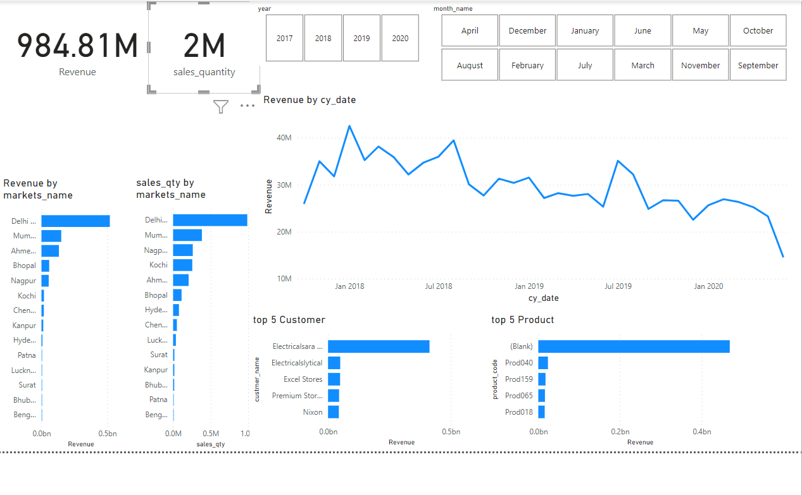

# Sales Insight of Hardware Company

## Introduction to Project :-
In this Project, we require to find Sales Insight of a hardware Company who selling their computer hardware and peripheral in India. Here, we will create Dashboard in Power BI from the data given by company containing information of their past product sold in different region of India. The company data is kept in Data Lake which is initially in OLTP stage . From there we will apply ETL processing over the data to bring it into structured format and Data Warehouse in OLAP stage so that we can Visualize it in Power BI or tableau Dashboard. The initially data will be SQL database format which we will be understand by us using MySQL workbench.

## Technology Used :-
* Python(Pandas, NumPy )
* SQL database
* Power BI
* Microsoft Excel
* Azure Data Lake/Data warehouse/Data Factory
